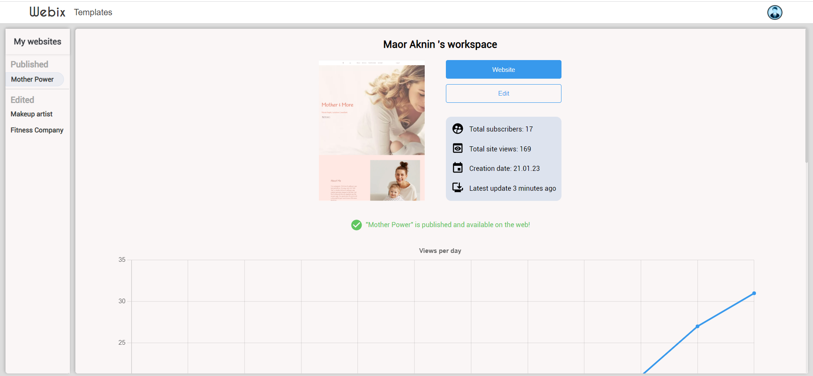

<div id="header" align="center">
    <h1>Webix</h1>
</div>

Webix is a website building platform inspired by wix.com, [Here is our website link](https://webix.onrender.com/ "Webix link").

If you are not familliar with the app, read about it [here](#webix-description).
And, if you only want to see some images of the website, [scroll to the bottom...](#showcase)


___

### Table of Contents
- [Webix Description](#webix-description)
- [Application Features](#application-features)
- [Technologies](#technologies)
- [Getting started](#getting-started)
- [Showcase](#showcase)

## Webix Description
Our easy-to-use editor allows you to create your site just the way you want. 
You can start from scratch with a blank template or open any designer-made template in the Webix editor. 

Our drag and drop technology lets you add different sections (e.g. heros, videos, maps forms, etc.) and place them wherever you want on your site. 
In addition, you can choose an element on your site. In response the editor will open  with a wide range of editing options that are relevant for the selected element.

You can easily change the theme of your site by choosing a theme from the sidebar editor. It will affect the fonts, text color and background colors throughout the site.

Edited sites get saved automatically as drafts in your dashboard. 
Every published website gets a custom domain. Your dashboard contains important information regarding your published and edited sites, including a real-time update of the amount of site views.


More information about the different features on Webix can be found in the [features section](#application-features).


## Application Features
✍ Google login, along with regular ***authentication*** which is encrypted and safe.

🖼 Designer-made ***templates*** to inspire the user.

🎨 ***Editor*** and ***themes*** that provide the ability to change different elements in the website (colors, fonts, text, images, videos, etc.).

📲 The ability to preview the website's ***responsiveness***.

🖐 ***Drag and drop*** technology for all the components on the website, and an ability to add and remove each one!

🖥 The ability to publish a website and get a ***custom domain***.

🗺 Adding a ***map*** and coordinates to the website.

📊 ***Dashboard*** that stores all the important data regarding the website.

## Technologies

The technology stack we used was MERN - MongoDB, Express, React, Node.js.
The app uses webSockets to update the views of each published site in real-time.
The API calls to the backend are done with the REST API method , and we used middlewares to authenticate and authorize actions.

We have used several third side libraries for different goals, such as google-login, D&D and more.
The layout and templates were made with Sass (functions, mixins, variables). 

## Getting started

Head to the repository on top and clone the project or download the files.

```
git clone https://github.com/MoriaHamami/Final-Project-CA.git
```

Enter the backend folder and make sure you have node_modules installed. After that we will initiate the server with 'npm run server:dev':

```
cd backend
npm i 
npm run server:dev
```

You shuold get a console ouput that the server is up and running at port 3030.
Enter the frontend folder and repeat the same process.

```
cd ..
cd frontend
npm i 
npm start
```

You shuold get a console ouput that the server is up and running at localhost:3000.

That's it! The App should be up, running, and open on the web, enjoy!

## Showcase

### Homepage
The landing page in which the user is introduced to Webix, and can select the call to action button which takes you to the templates page.


### Signup & Login
We created an e2e authentication flow, including encryption of the users' details, middlewares and ***Google Login***.


### Templates
Here the user can select his preferred initial website template. The user can also decide to start from scratch.


### Editor
The menu on the left which is opened automatically by selecting an elemnt on the website or by choosing the "Theme" or "Add" options, enables the user to customize his website easily.

The "Edit" option shows different options (depending which element was chosen). It includes text color, fonts, border-radius, uploading image, changing map coordinates, and much more.


The "Theme" option enables the user to change the colors and font of the site with one click. There is a wide range of themes to choose from.


The "Add" option opens a list of components to add to the website. Using D&D, the user can add the components to the website, and move them around to different parts of the website. 
While dragging a component in the website, a trashcan appears on the sidebar, and lets  the user remove the component from the website.


### Dashboard
The dashboard holds information regarding published websites, such as weekly site views (which is updated in real-time), last website update, creation date, the ability to edit the website again or go to the published website, etc.
In addition, every edited website is automatically saved to the dashboard and can be edited again, or previewed before publishing the website.



### A mobile fit!
We used different **mixins** and **conditional rendering** to create a responsive design. Just a taste of the mobile experience:


### Authors
 - [Moria Hamami](https://github.com/MoriaHamami)
 - [Guy Agam](https://github.com/GuyAgam)
 - [Maor Aknin](https://github.com/MaorAknin)
